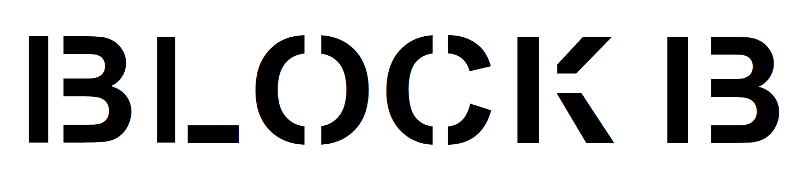
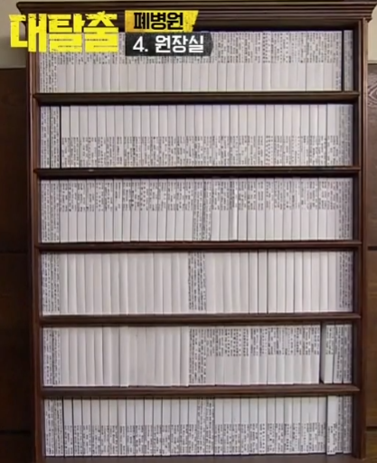
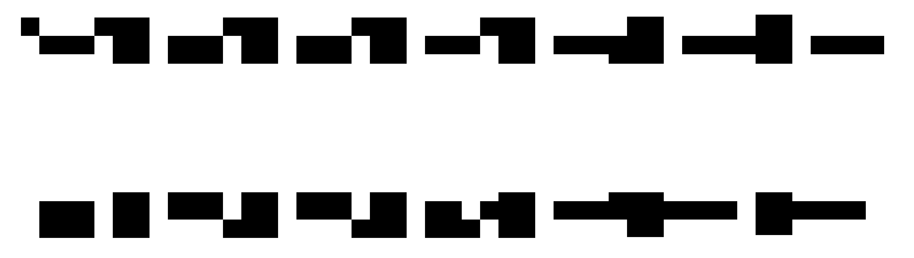

# 游戏策划书

## 关卡设计

关卡详细解释可能出现在地图草稿中

### Part 1 视觉

#### Phase 1 (2min, Difficulty : 1)

纯黑白视角（2色）

收集品1 —— “好眼力”

|  编号   | 位置  |       作用        |     名字      |
| :-----: | :---: | :---------------: | :-----------: |
|   1-1   | Room1 |  打开Room1-2门锁  |    枚举法     |
|   1-2   | Room2 |  打开Room2-3门锁  |   家具形状    |
|   1-3   | Room3 | 在Room3解锁Phase2 |   吊灯透视    |
|   1-4   | Room3 | 在Room3解锁Phase2 | 高度决定眼界I |
| 收集品1 | Room1 |      收集品       |    好眼力     |

1-1 ：枚举法

一位数密码，可以让玩家试出来，也可以让玩家无论输入什么都能打开

1-2 ：家具形状

进入Room2后，发现左边的物品呈现"9"字，右边的物品呈现"8"字，门锁密码为"98"

门锁上最好呈现一个方向（例如画一个箭头），不然反过来看也可以解读为"86"

1-3 ：吊灯透视

进入Room3后，回头看发现天花板的灯管连在一起是一个"48"

1-4 ：高度决定眼界I

只有蹲下才能看到底下有块板子，在Phase1可以看见它是"97"

将4897输入之后，Phase1的灯会亮，随后视角变为256色灰度图视角

收集品1：“好眼力”

在Room1X处可以发现藏在衣柜后面的收集品

#### Phase 2 (6min, Difficulty : 3)

|  编号   |  位置   |                作用                 |      名字      |
| :-----: | :-----: | :---------------------------------: | :------------: |
|   2-1   | Room1&2 | 关掉Room1-3的灯光，以看见电视机反光 |    整理衣服    |
|   2-2   |  Room3  |          在Room3解锁Phase2          |   电视机反光   |
|   2-3   |  Room3  |          在Room3解锁Phase2          | 高度决定眼界II |
| 收集品2 |  Room3  |               收集品                |     强迫症     |

黑白视角(256色灰度图)

2-1 ：整理衣服

Phase1灯亮后，洗衣机的提示响了，随后可以打开洗衣机，将衣服按照从小到大的顺序装进衣柜中，装完之后播放BGM

2-2 ：电视机反光

装完衣柜后BGM响起，灯全部关上，此时能通过反光看见电视机上的数字，这是解锁Phase2的第一个密码

2-3 ：高度决定眼界II

重新观察Room3桌子底下的板子，在Phase2可以看见它是"51"（上面涂了不同的颜色，颜色深浅不一样）

收集品2 ：“强迫症”

仔细观察发现这种语言是一种奇特的拼音文字，每个字都有偏旁部首组成，在Room1键盘上可以发现对应的组成部分，然后通过比较Room3中书本的顺序可以得出每本书应该在的位置

#### Phase 3 (8min, Difficulty : 4)

|  编号   |  位置   |              作用               |     名字     |
| :-----: | :-----: | :-----------------------------: | :----------: |
|   3-1   |  Room3  |         打开Room3-4门锁         |   转译文字   |
|   3-2   | Room1&3 |         打开谜题3-3的灯         |   寻找颜色   |
|   3-3   |  Room4  |       查询谜题3-4所在城市       |     光影     |
|   3-4   |  Room4  |        找到对应的街区号         |  象棋的隐喻  |
|   3-5   |  Room4  |        找到对应的楼栋号         | 环境影响认知 |
|   3-6   |  Room2  |         找到3-7中的线索         |     花盆     |
|   3-7   |  Room4  | 找到对应楼层号，打开Room4-5门锁 |   基本算数   |
| 收集品3 |  Room4  |             收集品              |    双刃剑    |

3-1 ：转译文字

打开电视机后上面写了一串文字（Phase1&2看不见电源），需要用Room1打开电脑后的搜索功能得出

3-2：寻找颜色

进门后出现一排开关，需要打开与Room1灯管上、Room3板子上、电视上出现过的所有颜色的灯

3-3：光影

能看到影子呈现某个数字，代表目的地所在城市，输入智能屏幕查看对应城市的地图

3-4：象棋的隐喻

仔细发现正确的地图上有个长得像国际象棋里王后的建筑，对应的坐标是D1，因此需要寻找的建筑物的街区号便可以知道

3-5：环境影响认知

包含博物馆的建筑物顶上写着"BLOCK B"，实际上是"BLOCK 13"，仔细看地图的其他部分能发现BLOCK1-BLOCK12

3-6：花盆

将花盆移动到合适的位置，可以打开抽屉，抽屉里有一封信，暗示这个世界数字采用16进制

3-7：基本算数

能数出来楼层在某一层，将城市号，街区号，楼栋号，楼层号输入传送门，大门打开

收集品3 ：“双刃剑”

在3-3中将图像切换成黑白模式，再打开特定光束，可以获得一块拼图

### Part 2 听觉

#### Phase 4 (3min, Difficulty : 2)

4-1 根据音乐辨识位置

4-2 根据音高弹出对应的音符

4-3 

### Part 3 空间感

房间构造本身亦是密码

穿墙bug

## 地图设计

### Room 1 卧室

门：类似于商场里的自动门，向左右拉开，不要拉把的门

门锁：一位数密码（谜题1-1）

置物架：无关谜题，上面可以摆点生活气息物件

电脑桌：键盘和谜题有关（谜题3-1、收集品2），在Phase1，由于电脑桌和电脑都是深色的，因此和墙壁融为一体，Phase1看不见，Phase2看不见电源

衣柜：打开后里面有些许衣服

收藏品1：衣柜后面藏了收藏品1（获得成就“好眼力”）：必须在X处才能看见

窗户：在X处可以看见窗户，不过在Phase1，外面是全白

床和枕头：与谜题无关

灯管：颜色和位置与后面的谜题有关（谜题1-3、3-2）

### Room 2 起居室

灯管：和谜题1-3有关

卧室门：从卧室过来后一直保持开启状态

书房门：门锁在冰箱上，或者在地上（地上的话可以在两个数字之间添加一个向前的箭头，对谜题1-2有帮助）

洗衣机上面的问号：具体放什么东西与谜题关系不大（只与1-2有关），只需尽可能填满即可（本来想放烘干机但感觉有点多余）

洗衣机：与谜题2-1有关

灶台上可以放点东西

油烟机和锅：尽可能将中间填满，这里想用白气将"9"的中间一横填满

柜子、冰箱：只与谜题1-2有关

窗户：在Phase1，只能看到一片白色，Phase2开始可以看见太阳、外面的草坪和树（与后面的谜题有关）

下方图：解释谜题3-6，每朵花有红色和绿色的叶子，当移动花盆至绿色叶子都可以相连时，抽屉打开

抽屉打开后里面有一张信，从信里可以发现这个世界的地址表示方式，以及使用16进制

### Room 3 书房

棋盘：带坐标编号的国际象棋棋盘，上面摆着相应的棋子，用于谜题3-4

窗：当灯关上时，通过窗能看到写在电视机屏幕上的电视机反光的数字

电视：Phase3才能看到电源，打开电视

书柜：一开始有零散的书散落在地板上，可以把书放回去，放回去之后呈现一个收集品的形状（例如拼图，可以参考下图：）

仪器：输入四个数字后按下按钮进入Phase2，输入四个数字后按下按钮进入Phase3

沙发：空间合理化

### Room 4 大厅

这个大厅的设定是，在未来世界里，人们出门可以通过输入目的地直接传送至对应楼层

这里背景故事设定是需要去某个博物馆

板2是播放动画，或者展示一张图画 表示博物馆所在楼栋和楼层

解释下谜题3-5：大概写成这样的形式：

板1可以输入城市编码查询对应的城市地图，设定是博物馆所在的城市俯瞰图里有一个跟国际象棋皇后&国王一样的公园，因此可以得出博物馆的对应区块。

右边输入目的地：在输入板的上面和下面分别放置：

(ADDRESS)

右下角图：解释谜题1-3的大致形态

