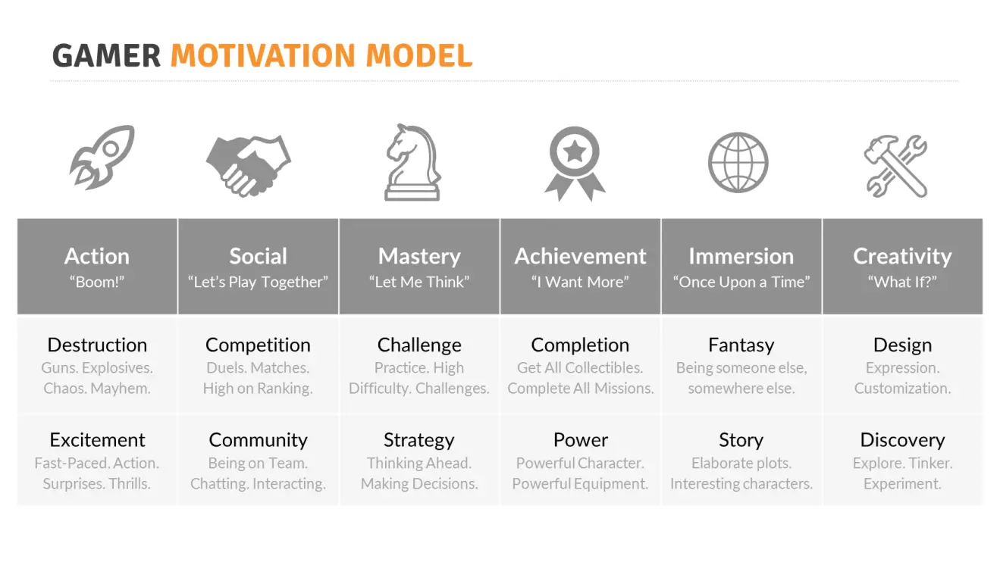
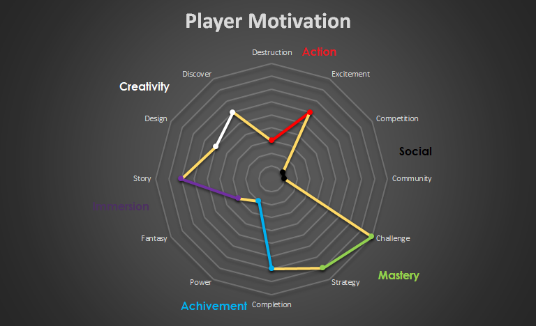

# Designer Talk

谈一谈 Realm : Before the Omniscience 这个游戏是怎么诞生的以及在这次游戏制作中学到了什么

我们的身份：四个程序猿

### 游戏定位

最重要的应该就是游戏定位了 他决定了游戏的大框架

我们的作业题目是 3D游戏，除此之外没有任何别的要求

然后我们的时间 在当时看来可能有几个月，但当时大家都有其他的课业需要完成，我们只留了两周的开发时间，前期基本上是小打小闹的策划

那么我们的限制就很清楚了：这个游戏必然不可能有非常大而华丽的场景（因为这里需要耗费很多时间），而且当时并没有接触过UE4的我们也并不知道怎么做动画，学习成本可能很高

因此我们就最后打算做一个单机解谜类游戏【本来打算做双人解谜的 考虑到还要写网络连接客户端啥的就很难受

毕竟这类游戏它动作元素较少。

然后我去摸了个GDC的视频，上面提到了游戏设计中关于玩家动机的模型，分为六个大类

这个具体不细讲，大伙可以看看这个链接，大致分为的六种类型是：

1. action，也就是动作要素，这包含场景的摧毁（枪战），以及带给玩家的兴奋和紧张感（惊吓、格斗等等）
2. social，社交要素，这个游戏是否能一起玩，是否有社群（例如）或者竞争性质
3. mastery，征服，或者说解决难题，这个是广义的，它可以包括一些挑战，或者一些策略性
4. achievement，成就，例如游戏的完整性，是否有主线任务及其强烈的完成提示，以及收集品，另一方面玩家是否能在游戏过程中逐渐熟练地掌握某项技能或学习能力，例如学习法术等等
5. immersion，沉浸感，对我来说最重要的是游戏的叙事性，以及它是否足够精彩
6. creativity，创造力，游戏是否提供给玩家自由发挥创造的空间，例如去发现探索某片大陆，或者自己发明一个物体（例如废品回收师或者马里奥制造这种游戏就在这方面做的很好）

https://www.bilibili.com/video/BV1Ah411f79x

随后我根据其他三个人给我的草案（这个草案大家可以在git仓库中看到）以及我们的长短处，最终将玩家定位如下：

我们将重心放在谜题设计上，减少了一些动画要素（例如法术），以及社交要素。

### 游戏概念

最终根据四份草案糅合一下确定了整个游戏的概念——逐渐形成的感知觉

这里灵感还参考了一些东西，一个是从今年美院建筑学院毕设展，建筑学院展的主题是实验的深度，在它们很多展品里面，提供了一些基于电影转译的想法，以及一些非常有趣的空间设计，一部分空间设计的遐想体现在了游戏中。这逐渐让我想起了之前看的一部电影，电影讲的主旨大概是人类沉浸于自己的感官带来的无限快乐中，从而逐渐丧失自我，或者在另一方面，找到了最真实的自我。

因此 想到了这个游戏最初的concept：（其实大家可以在document里的概念设计书里看到）

通过这个游戏让玩家体会到“知觉控制人的大脑”这一concept，我们分为了四个层次：

描述感觉的重要性及给人生活的作用及影响

1. - 通过让玩家失去相应的感觉体会
   - 通过让玩家获得不健全的感觉体会
2. 描述感觉的主导性、互动性及其对人的生理作用
   - 通过感觉产生的心理错觉体现
   - 通过单一感觉的误导性体现
3. 描述感觉是由大脑加工的及可能产生的错觉
   - 通过常态空间中的错觉体现
   - 通过建构不存在的空间导致违反常态感觉的效果体现
4. 描述人类的本质是由大脑加工的（备选项）
   - 通过可以自定义修改的感官体系体现

然后我们确定了章节和背景主线

章节：暂定为三章，听觉(Auditory Sensation)，视觉(Vision)以及空间感(Sense of space)，【在思考能否由玩家选择顺序的可能性】

背景及主线：玩家起来发现自己处于一个人的家中，通过慢慢探索了解家里的秘密，以出行目标为导向，建立起到听觉和空间感实验室的一条故事线，最终空间形成闭环，以特殊的形式打破空间，进入结局。

