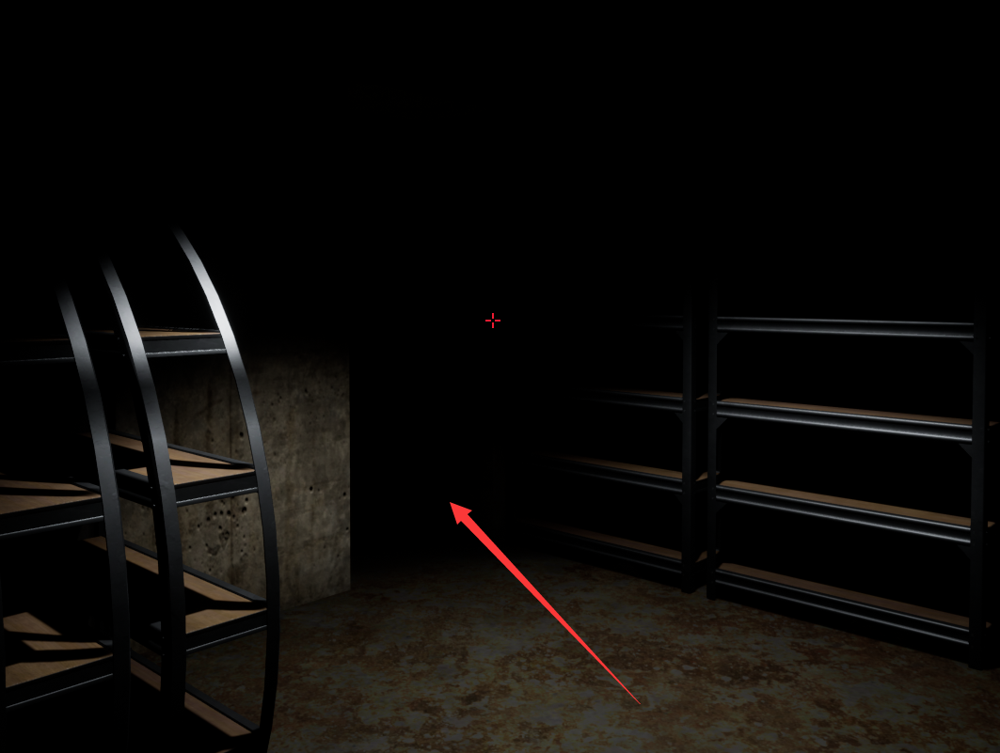
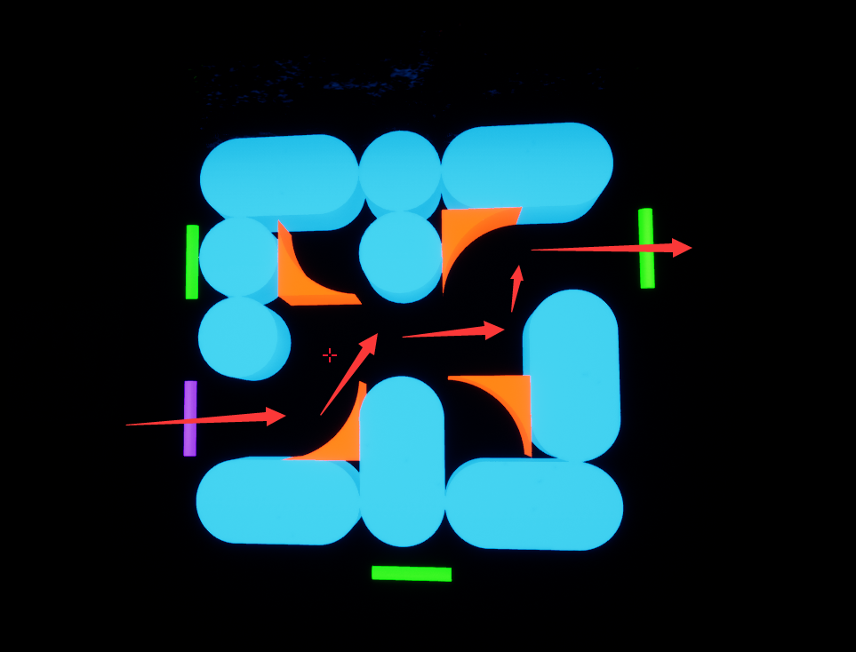
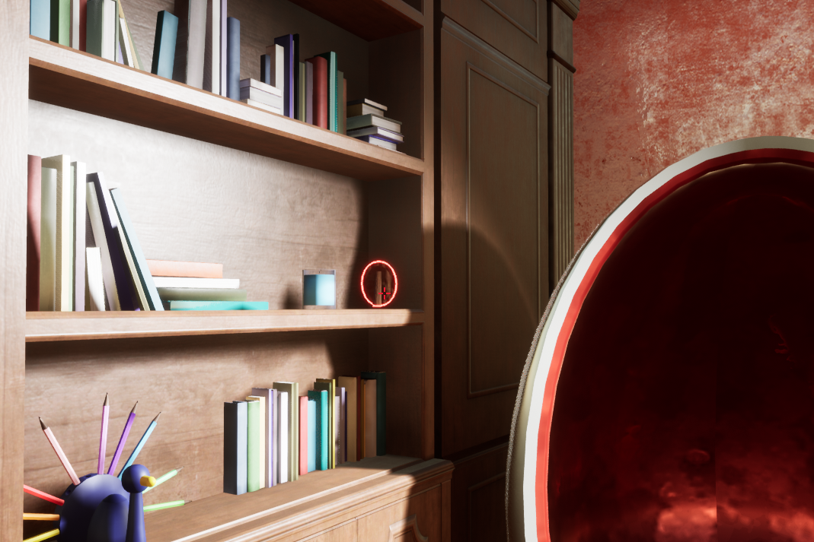
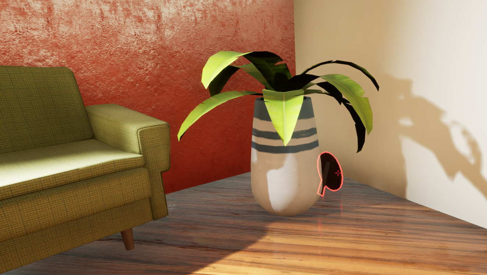

# 说明

## 游戏说明

- 本游戏具有解谜、动作与恐怖要素，不适合光癫痫症患者游玩
- 本游戏难度分为简单、普通与困难，其中困难难度仅适合十分希望挑战自我的玩家游玩

## 操作说明

- WASD：控制人物前后左右移动
- 鼠标移动：控制人物视角
- 空格键：使人物跳跃
- 鼠标左键点击：对大部分可交互物体进行交互
- O键：在解开Room3的电视谜题之后，可用于切换灰度色视觉与全彩色视觉
- H键：触发解谜提示（如果有），推荐在确实卡关的情况下使用
- IJKL键：用于控制一些特殊机关（会有特殊提示）
- ESC键：暂停游戏并展示菜单

## 交互说明

- 可交互物体一般可以鼠标左键点击交互，部分使用IJKL键交互
- 鼠标移动到任何可交互物体上时，物体将显示闪烁勾边光圈
- 闪烁勾边光圈在灰度色视觉下为灰白色，在全彩色视觉下为红色
- 所有可交互物体均对解谜有直接作用，部分不可交互物体对解谜也有作用

# 游戏攻略

注：本攻略包含**全部谜题解谜过程**以及**隐藏收集品**的收集方式，仅建议在确实感到通关困难时查阅

## 主线流程

### 房间 1

抬头，可以发现门上有一个可以交互的O/X方块

鼠标左键点击该方块即可开门

### 房间 2 

房间2类似地在门上有两位数字密码

注意到数字密码旁有发亮的白线连出，该白线最终连接到了房间另一端的墙上

从稍远处观察，可以看出另一端墙上显示出了“5”与“3”的阿拉伯数字样式

根据白线连接的顺序，将密码设置为35即开门

在门旁边可以发现一个花图案的可交互按钮，点下后可以发现房间3出现了一些花方块，但由于目前的色觉能力尚不能解谜

### 房间 3

在房间中部有一个电视机样式的家具，该家具的左右两边各有两位的数字密码

站在家具附近，朝房间2方向抬头看并调整站立位置与观察角度，可以发现空中凌乱的灯管呈现“46”阿拉伯数字样式且数字上方有一条横线，回头看则另一些灯管呈现“73”样式且数字下方有一条横线

观察密码输入处，可以发现两个密码数字的上下方分别有横线，与先前的灯管相对应，得出左边应该输入73，右边应当输入46。在输入完成后，根据发光圆弧和猫摆设的提示，按下电视机前的按钮，获得全彩色觉并打开通过房间4的门

此时由于获得了全彩色觉，回到房间2，可以发现关于花方块如何解谜的提示：

可以发现，每个花方块上有绿色花瓣与红色花瓣，需要将所有方块的绿色方块连接起来。回到房间3，发现点击花方块可以将其移动到相邻的空处（如果没有相邻空处则无效）。通过一些尝试，将所有绿花瓣连接之后如下图：

此时左侧的箱子将发出声音，查看之后发现里面有一个超市小票（弹出提示：完全正确的小票），内容如下：

根据上述小票，玩家可以发现两个主要信息：自己的**家庭住址代号**为BG-E4-06-10；这个世界的数字系统是**八进制**

### 房间 4

进入房间4后，可以发现墙上有需要输入城市代码、街区编号、楼栋编号、楼层号的密码：

而门旁边的黑板上则写着“去听感实验室的”的字样：

因此，玩家需要推断出听感实验室的地址代码。根据先前购物小票的家庭住址格式，可以发现城市名为两个字母，街区编号为一个字母+一个数字，楼栋编号与楼层号均为两个数字。

根据房间中的第二幅画，可以发现听感实验室在一栋白色楼房的**13栋**：

同时，由于图中的棋牌室为2楼，向上可以数出楼层为13楼（十进制下）。由于前面购物小票的提示以及各密码锁从未出现8和9的数字，可以推断出这个世界为**八进制**的世界，因此转换为八进制是**15**楼

再根据第一幅画，可以找到这栋白色建筑就在**BG**城市中的红圈位置：

在房间3的电视机旁边有一个可以点击的国际象棋棋盘，内容如下：

可以发现，棋盘上有数字和字母坐标，并且可以发现红圈部分的国王棋子、皇后棋子的样式以及黑白底色与城市地图左下角的两个街区十分相似：

因此，可以推断出城市地图左下角的坐标为白方国王的坐标，即D0。进一步可以推断出城市地图中白色楼栋所在街区的坐标为**F4**（Y方向增加4，X方向增加2）

综上所述，城市为BG，街区为F4，楼栋为13，楼层为15。将**BG-F4-13-15**输入密码锁之后，传送门打开：

玩家进入后传送至房间5

### 房间5

在房间5，首先点击电梯按钮：

电梯门打开后，进入电梯门，并点击15层（听感实验室的楼层）：

可以发现电梯不知为何，最终停留在了16层：

### 房间6

首先通过长走廊，可以发现走廊尽头的左侧门是关闭的，只能前往右侧：

右侧是一个弯走廊，走到尽头之后可以发现一个门，走进去是一个大厅：

在大厅里，进入另一扇门：

进门之后左转是一条直走廊，走到尽头之后左转进入监控室：

在监控室里点击“开门”按钮，可以观察到远处有一扇门（一开始长走廊尽头的门）打开了：

原路返回长走廊尽头，发现门的确打开了，进入大房间：

在大房间的书桌处进入柜子后侧，走进去，在一个缺口处右转：

可以发现刚刚进入的位置头上有个绿色灯条，前方有紫色灯条，进入紫色灯条所在的房间：

发现一个控制面板，根据提示可以使用IJKL操作面板上的蓝色物体：

根据操作之后的声音方位变化，可以联想到对于这个操作板上的操作会影响到外面房间的构造。由于目前玩家处在紫色灯条的位置，而绿色灯条有两处（一处是入口，另一处是目标点）。因此，通过移动蓝色方块，构造出一条可以让**玩家**从紫色灯条到达绿色灯条的路径（注意到玩家可以通过橙色弧形墙壁但蓝色方块不可以）：

到达紫色灯条下方，可以发现一条到另一个房间的路：

进入房间后，看到五个人围绕着篝火，但其中两个人缺少了面具，点击穿黄色衣服缺少面具的人：

BGM与灯光发生变化，提示“寻找面具0/2”。同时，墙壁上出现关键地图提示（根据难度不同地图也会不同）：

玩家需要前往这两个红星位置寻找面具，因此首先原路返回紫色灯条的房间，控制蓝色方块构造出回到最出入口的路径：

然后原路返回最初的长走廊：

可以发现此时走廊上出现了很多面具人，在远处右侧（即靠近电梯的位置）有一个可以交互的面具人，点击获得面具（1/2）：

回到长走廊末端，向右再次进入弯回廊：

类似地走到弯回廊末端并进入房间从另一个门出来：

此时玩家位于地图上的金黄色圈的位置，根据实际地图上的位置找到第二个面具人并点击（以困难为例）：

收集之后出现“归还面具”，此时原本来路的大门已经关闭，需要从另一个房间出去，路线如下：

然后返回控制室：

将控制台的状态恢复为可以进入篝火房间的状态，回到篝火房间，将面具还给没有面具的人：

此时显示“道路已打开”，进入打开的新房间：

进入逃离门，向下一层（即进入15层声感实验室-房间7）：

### 房间7

### 房间8

### 房间9

### 房间10

### 房间11

### 房间12

## 隐藏收集品流程

### 收集品 1-好眼力

在房间 1靠近大柱子一侧的一个柜子后面有一个可交互的礼品盒，点击收集

### 收集品 2-强迫症

在房间3门口处墙上，可以发现有一张贴着各种鸟图片的画：

而在房间3另一侧，有一个明显空荡荡的陈列柜：

因此，该隐藏要素的解锁条件是在前3个房间中找到所有消失的鸟画，分别在以下位置：

在放回所有画之后，将提示“书柜似乎整理好了”，此时回到书柜，发现出现了一个新的礼物盒，点击收取：

### 收集品3-不忘初心

在房间4，彩色模式下可以发现墙上有一个碎花样的礼物盒图片：

根据颜色空间变换的知识可以想到，如果恢复成灰度色视觉下图片可能会呈现出不同的样子。按下O键，切换回灰度色视觉。此时可以发现礼物盒图片被修复了，点击获得隐藏收集品：

### 收集品4-穿模Bug？

在房间5，细心观察可以发现墙壁的弧度有一片区域不太正确：

实际上这篇区域的墙不会阻挡玩家进入的，因此可以直接移动到墙内，可以发现一个礼物盒，点击获得隐藏收集品：

### 收集品5-遁入黑暗

在房间6，当触发了收集面具任务之后，控制台中可以发现下方的房间灯条由红色变为绿色;

调整控制台获得一条紫色到下方绿色灯条的路：

进入下方的绿色房间：

这个房间是一个全黑的房间，只有灯条用于表示方向，玩家需要不断移动并切换视角，找到全黑房间中的礼品盒，点击收集隐藏收集品

### 额外彩蛋1-台球公园

注：本菜单不作为收集品

类似前往听感实验室的密码推理过程，可以得出听感实验室所在楼栋的代号为BG-F4-13，同时注意到房间4中第二图图片有棋牌台球室的位于二楼的标识：

因此，在房间4的密码中输入BG-F4-13-02，传送门将打开：

进入传送门后，玩家将被传送到一个巨大的台球游乐园：

在感受过风景之后，玩家可以原路返回传送回房间4

### 额外彩蛋2-回家

注：本彩蛋不作为收集品

根据购物小票的提示，自己家的地址为BG-E4-06-10。在房间4的密码中输入BG-E4-06-10，传送门将打开：

此时进入传送门将传送至房间1（即自己家）

